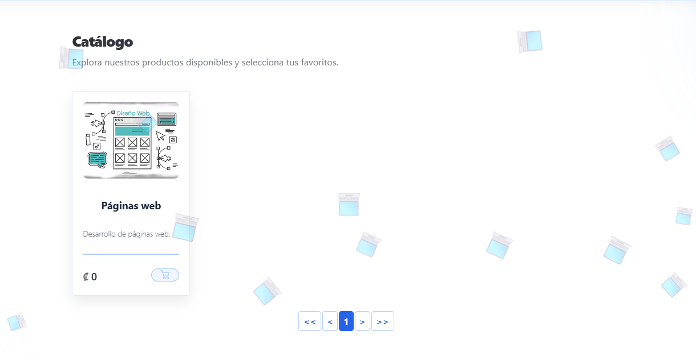
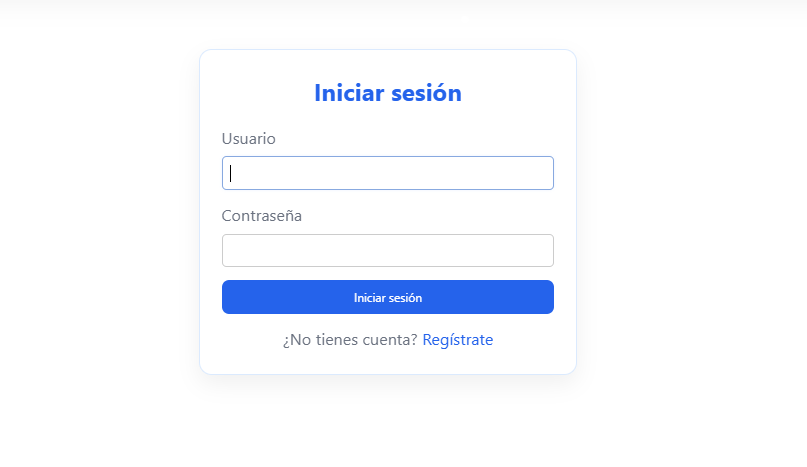

# duohnson — Catálogo virtual con carrito de compras

<p align="center">
  
  
  
  
</p>

---

## Tabla de contenido

- [Acceso ADMIN](#acceso-admin)
- [Arquitectura del proyecto](#arquitectura-del-proyecto)
- [Funcionalidades](#funcionalidades)
- [Stack técnico](#stack-técnico)
- [Estructura de directorios](#estructura-de-directorios)
- [proyecto desarrollado para strawberrydaki.com](#proyecto-desarrollado-para-strawberrydaki.com)
- [Efecto de caída de emojis](#efecto-de-caída-de-emojis)
- [Requisitos previos](#requisitos-previos)
- [Instalación y configuración](#instalación-y-configuración)
- [Variables de entorno](#variables-de-entorno)
- [Modelo de datos](#modelo-de-datos)
- [Middleware personalizado](#middleware-personalizado)
- [Endpoints principales](#endpoints-principales)
- [Despliegue en producción](#despliegue-en-producción)
- [Capturas](#capturas)

---

## Acceso ADMIN

Para desarrollo y pruebas rápidas, el proyecto está configurado por defecto para usar SQLite3 como base de datos local. Sin embargo, se recomienda el uso de MySQL en producción para mayor robustez y escalabilidad.

Puedes acceder al panel de administración de Django con el siguiente usuario de prueba:

* Usuario: **admin**
* Contraseña: **admin**

Recuerda cambiar estas credenciales y la base de datos antes de desplegar en producción.

---

## Arquitectura del proyecto

El proyecto sigue una arquitectura modular basada en Django apps, donde cada dominio del negocio está encapsulado en su propia aplicación:

```
proyecto/            → Configuración central (settings, urls, middleware, wsgi)
home/                → Página principal y contacto
tienda/              → Catálogo, detalle de producto, carrito de compras
buscador/            → Motor de búsqueda por texto con paginación
usuarios/            → Registro, login, logout, perfil con foto
```

La comunicación entre apps se mantiene desacoplada: `home` consulta productos de `tienda` solo para mostrar ofertas en la landing, y `buscador` filtra contra el modelo `Producto` sin dependencias circulares.

---

## Funcionalidades

| Módulo | Descripción |
|---|---|
| **Catálogo** | Listado paginado de productos con múltiples imágenes por producto. Soporte de carrusel en la vista de detalle. |
| **Carrito** | Carrito persistente por usuario autenticado. Agregar, eliminar productos y ver el total en tiempo real. |
| **Pedido por WhatsApp** | Al confirmar el carrito, se genera automáticamente un mensaje con el detalle completo del pedido y se abre WhatsApp con el texto prellenado. |
| **Búsqueda** | Filtrado por nombre y descripción con consultas `Q` de Django. Resultados paginados. |
| **Autenticación** | Registro con validación de contraseñas, login/logout, y perfil con carga de foto de perfil. |
| **Ofertas** | Los productos marcados como oferta se muestran destacados en la página principal. |
| **Perfil de usuario** | Foto de perfil visible en la navbar. Signals de Django crean el perfil automáticamente al registrarse. |
| **Panel de admin** | Gestión completa de productos e imágenes desde el admin de Django con inlines. |
| **Efecto de emojis** | Efecto decorativo de emojis caídos configurable desde JavaScript para fechas especiales. |
---

## Stack técnico

| Capa | Tecnología |
|---|---|
| Backend | Django 6.0 (Python 3.12+) |
| Base de datos | MySQL 8.0 |
| Servidor WSGI (producción) | Waitress |
| Archivos estáticos | WhiteNoise con compresión |
| Frontend | HTML5, CSS3 vanilla, JavaScript vanilla |
| Gestión de imágenes | Pillow |
| Variables de entorno | python-dotenv |

---

## Estructura de directorios

```
├── manage.py                  # Utilidad CLI de Django
├── run.py                     # Servidor de producción (Waitress + WhiteNoise)
├── requirements.txt           # Dependencias del proyecto
├── .env.template              # Plantilla de variables de entorno
├── .gitignore                 # Archivos excluidos de git
│
├── project/                  # Configuración central
│   ├── settings.py            # Settings con variables de entorno y MySQL
│   ├── urls.py                # Rutas raíz del proyecto
│   ├── middleware.py          # Middleware de seguridad, timing y rate limiting
│   ├── wsgi.py
│   └── asgi.py
│
├── home/                      # App: landing y contacto
│   ├── views.py
│   ├── urls.py
│   └── templates/home/
│       ├── index.html         # Página principal con ofertas
│       └── contact.html       # Información del negocio
│
├── shop/                    # App: catálogo y carrito
│   ├── models.py              # Producto, ProductImage, Cart, CartItem
│   ├── views.py               # CRUD del carrito, catálogo, detalle
│   ├── admin.py               # Admin con imágenes inline
│   ├── context_processors.py  # Contador de carrito global
│   ├── urls.py
│   └── templates/home/
│       ├── catalog.html      # Grilla de productos paginada
│       ├── product_detail.html  # Detalle con carrusel de imágenes
│       └── cart.html           # Vista del carrito
│
├── search/                  # App: búsqueda de productos
│   ├── views.py               # Búsqueda con Q lookups
│   └── templates/home/
│       └── search.html        # Resultados de búsqueda
│
├── users/                  # App: autenticación y perfiles
│   ├── models.py              # Profile (foto de perfil)
│   ├── views.py               # Registro, login, logout, perfil
│   ├── signals.py             # Auto-creación de perfil
│   └── templates/usuarios/
│       ├── login.html
│       ├── register.html
│       └── profile.html
│
├── templates/
│   └── base.html              # Template base con navbar, footer, búsqueda
│
├── static/
│   ├── css/
│   │   ├── style.css          # Estilos principales (responsive)
│   │   └── snow.css           # Efecto decorativo de nieve
│   ├── js/
│   │   └── snow.js            # Generador de copos de nieve
│   └── img/                   # Imágenes estáticas
│
└── media/                     # Uploads de usuarios (gitignored)
    ├── productos/
    └── perfiles/
```
## Proyecto desarrollado para strawberrydaki.com

Este proyecto fue creado para el sitio web:

**[strawberrydaki.com](https://strawberrydaki.com/)**

La plataforma implementa un catálogo virtual, carrito de compras, autenticación de usuarios y efectos visuales personalizables, adaptados a las necesidades de strawberrydaki.com.

---

## Efecto de caída de emojis

Para cambiar el emoji o la opacidad del efecto decorativo:

1. Abre el archivo `static/js/emoji-fall.js`.
2. Edita la variable `emoji` para el símbolo que desees (por ejemplo, '💥', '❄️', '💻', etc).
3. Edita la variable `emojiOpacity` para ajustar la opacidad (valor entre 0.0 y 1.0).

No es necesario cambiar nada en el admin de Django ni en la base de datos. El efecto se controla únicamente desde el archivo JS.
Esto se implemento a petición del cliente para fechas especiales, al tomar la iniciativa para dejarlo en el proyecto, se decidió hacerlo configurable desde el JS para no tener que tocar el código en producción.
Borrando el emoji o poniendo una opacidad de 0 se desactivaría el efecto sin necesidad de eliminar el archivo JS ni modificar el HTML.

---

## Requisitos previos

- **Python** 3.12 o superior
- **MySQL** 8.0 o superior (con una base de datos creada llamada `base`)
- **pip** actualizado
- **Git**

---

## Instalación y configuración

### 1. Clonar el repositorio

```bash
git clone https://github.com/duohnson/virtual-catalog.git
cd tu-repositorio
```

### 2. Crear entorno virtual

```bash
python -m venv venv

# Windows
venv\Scripts\activate

# Linux / macOS
source venv/bin/activate
```

### 3. Instalar dependencias

```bash
pip install -r requirements.txt
```

### 4. Crear la base de datos en MySQL

```sql
CREATE DATABASE base CHARACTER SET utf8mb4 COLLATE utf8mb4_unicode_ci;
```

### 5. Configurar variables de entorno

```bash
cp .env.template .env
```

Editar el archivo `.env` con los datos de conexión a la base de datos y la clave secreta. Para generar una clave segura:

```bash
python -c "from django.core.management.utils import get_random_secret_key; print(get_random_secret_key())"
```

### 6. Ejecutar migraciones

```bash
python manage.py migrate
```

### 7. Crear superusuario

```bash
python manage.py createsuperuser
```

### 8. Recopilar archivos estáticos

```bash
python manage.py collectstatic --noinput
```

### 9. Iniciar el servidor de desarrollo

```bash
python manage.py runserver
```

Acceder a `http://127.0.0.1:8000/` para ver el sitio.

Para producción, usar el servidor Waitress:

```bash
python run.py
```

---

## Variables de entorno

| Variable | Descripción | Ejemplo |
|---|---|---|
| `SECRET_KEY` | Clave secreta de Django | `d1$k3y...` |
| `DEBUG` | Modo debug (`True` / `False`) | `True` |
| `ALLOWED_HOSTS` | Hosts permitidos separados por coma | `localhost,127.0.0.1` |
| `DB_NAME` | Nombre de la base de datos | `base` |
| `DB_USER` | Usuario de MySQL | `root` |
| `DB_PASSWORD` | Contraseña de MySQL | `mi_password` |
| `DB_HOST` | Host de la base de datos | `localhost` |
| `DB_PORT` | Puerto de MySQL | `3306` |

---

## Modelo de datos

```
┌──────────────┐       ┌──────────────────┐
│   Producto   │       │   ProductImage   │
├──────────────┤       ├──────────────────┤
│ id           │──┐    │ id               │
│ nombre       │  │    │ producto (FK)    │──┐
│ precio       │  └───>│ imagen           │  │
│ descripcion  │       └──────────────────┘  │
│ is_oferta    │                              │
└──────────────┘                              │
       │                                      │
       │ (referenciado por CartItem)           │
       ▼                                      │
┌──────────────┐       ┌──────────────────┐   │
│   CartItem   │       │      Cart        │   │
├──────────────┤       ├──────────────────┤   │
│ id           │       │ id               │   │
│ cart (FK)    │──────>│ user (1:1 User)  │   │
│ producto(FK) │       │ created_at       │   │
│ quantity     │       └──────────────────┘   │
└──────────────┘                              │
                                              │
┌──────────────┐       ┌──────────────────┐   │
│    User      │       │    Profile       │   │
│  (Django)    │──────>│ user (1:1)       │   │
│              │       │ foto_perfil      │   │
└──────────────┘       └──────────────────┘   │
```

Cada producto puede tener múltiples imágenes a través de `ProductImage`. El carrito (`Cart`) es uno por usuario, y cada `CartItem` vincula un producto con su cantidad. El `Profile` extiende al modelo `User` de Django con una foto de perfil, creándose automáticamente mediante signals.

---

## Middleware personalizado

Implementé tres middleware ubicados en `project/middleware.py`:

### SecurityHeadersMiddleware

Agrega cabeceras de seguridad HTTP a cada respuesta:
- `X-Content-Type-Options: nosniff` — previene MIME sniffing
- `X-XSS-Protection: 1; mode=block` — protección contra XSS reflejado
- `Referrer-Policy: strict-origin-when-cross-origin` — controla qué información del referrer se envía
- `Permissions-Policy` — deshabilita acceso a geolocalización, micrófono y cámara
- `Strict-Transport-Security` — fuerza HTTPS en producción

### RequestTimingMiddleware

Mide el tiempo de procesamiento de cada petición. Si un request tarda más de 1 segundo, registra un warning en los logs. Útil para identificar endpoints con problemas de rendimiento.

### RateLimitMiddleware

Limitador de peticiones por IP en memoria. Restringe a 100 requests por minuto por IP cuando `DEBUG=False`. Ante exceso, responde con HTTP 429. Los parámetros son configurables desde `settings.py` con `RATE_LIMIT_MAX_REQUESTS` y `RATE_LIMIT_WINDOW`.

---

## Endpoints principales

| Método | Ruta | Vista | Descripción |
|---|---|---|---|
| GET | `/` | `home.index` | Landing con ofertas |
| GET | `/contact/` | `home.contact` | Información de contacto |
| GET | `/catalog/` | `shop.catalog` | Catálogo paginado |
| GET | `/catalog/product/<id>/` | `shop.product_detail` | Detalle con carrusel |
| POST | `/catalog/product/<id>/add_to_cart/` | `shop.add_to_cart` | Agregar al carrito |
| GET | `/catalog/cart/` | `shop.view_cart` | Ver carrito |
| GET | `/catalog/cart/remove/<id>/` | `shop.remove_from_cart` | Eliminar del carrito |
| GET | `/search/?q=texto` | `search.buscar` | Búsqueda de productos |
| GET/POST | `/users/register/` | `users.registro_view` | Registro |
| GET/POST | `/users/login/` | `users.login_view` | Login |
| GET | `/users/logout/` | `users.logout_view` | Logout |
| GET/POST | `/users/profile/` | `users.perfil_view` | Perfil de usuario |
| — | `/admin/` | Admin de Django | Panel de administración |

---

## Despliegue en producción

### Configuración mínima

1. Establecer `DEBUG=False` en `.env`
2. Configurar `ALLOWED_HOSTS` con el dominio real
3. Generar una `SECRET_KEY` segura y distinta a la de desarrollo
4. Ejecutar `python manage.py collectstatic --noinput`

### Seguridad automática en producción

Cuando `DEBUG=False`, el proyecto activa automáticamente:

- Redirección forzada a HTTPS (`SECURE_SSL_REDIRECT`)
- Cookies de sesión y CSRF marcadas como seguras
- HSTS con preload habilitado (1 año)
- `X-Frame-Options: DENY`
- Rate limiting activo (100 req/min por IP)

### Servidor recomendado

El archivo `run.py` levanta Waitress con WhiteNoise integrado, listo para producción en Windows o Linux sin necesidad de Nginx para archivos estáticos:

```bash
python run.py
```

Para entornos Linux con mayor carga, se puede reemplazar Waitress por Gunicorn y usar Nginx como reverse proxy.

---

## Capturas

A continuación, se muestran algunas capturas de pantalla del sitio:

### Página principal


### Catálogo de productos


### Inicio de sesión



